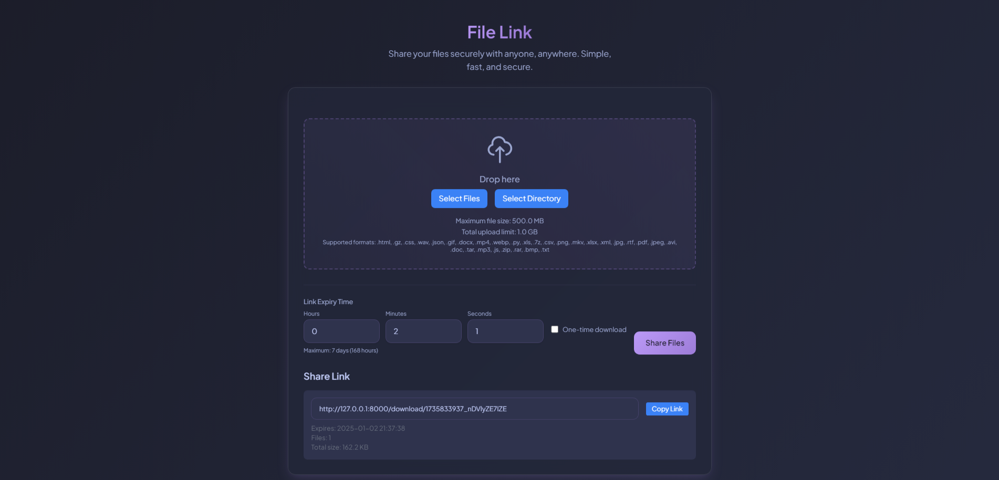
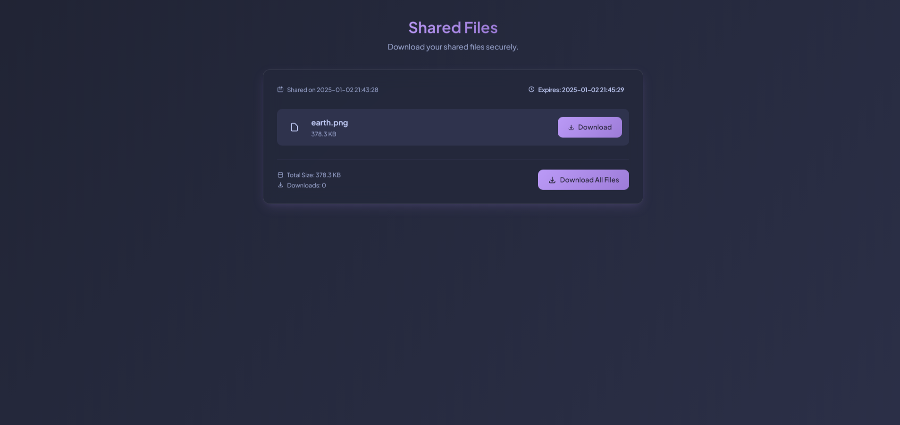

# FileLink - Simple File Sharing

A web application that lets you share files securely with customizable expiration times.

## Features
- Upload and share files with unique links
- Set custom expiration times for shared links
- One-time download option
- Multiple file upload support
- Drag and drop interface
- Responsive design

## Screenshots

*Home page with file upload interface*


*Download page showing shared files*

## Setup

1. Clone the repository:
```bash
git clone https://github.com/fraktalcow/file-link.git
cd file-link
```

2. Create and activate virtual environment:
```bash
python -m venv venv
source venv/bin/activate  # On Windows use `venv\Scripts\activate`
```

3. Install dependencies:
```bash
pip install -r requirements.txt
```

4. Run the application:
```bash
uvicorn app:app --reload
```

5. Open `http://127.0.0.1:8000` in your browser.

## Technical Details

- Backend: FastAPI
- Frontend: HTML, JavaScript, TailwindCSS
- File Storage: Local storage with automatic cleanup
- Security: Rate limiting and file validation

